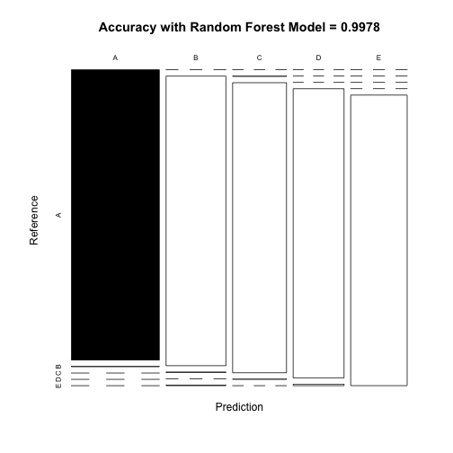
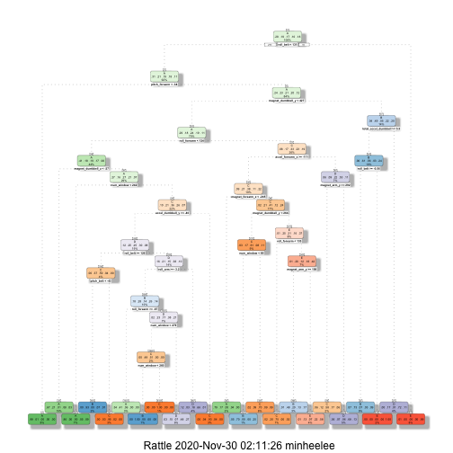
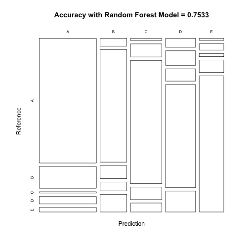

# Course Project - Practical Machine Learning: How Well Do People Exercise?

Using devices such as Jawbone Up, Nike FuelBand, and Fitbit it is now possible to collect a large amount of data about personal activity relatively inexpensively. These type of devices are part of the quantified self movement – a group of enthusiasts who take measurements about themselves regularly to improve their health, to find patterns in their behavior, or because they are tech geeks. One thing that people regularly do is quantify how much of a particular activity they do, but they rarely quantify how well they do it. In this project, your goal will be to use data from accelerometers on the belt, forearm, arm, and dumbell of 6 participants. They were asked to perform barbell lifts correctly and incorrectly in 5 different ways. More information is available from the website here: http://web.archive.org/web/20161224072740/http:/groupware.les.inf.puc-rio.br/har (see the section on the Weight Lifting Exercise Dataset).

## Setup

Before starting the analysis, it is important to clean up the environment, set the right working directory and load the packages you need for the analysis.

```r
rm(list=ls())
getwd()
```

```
## [1] "/Users/minheelee/Documents/1st year/Econometrics/R/Practical Machine Learning"
```

```r
setwd("~/Documents/1st year/Econometrics/R/Practical Machine Learning")

library(knitr)
library(caret)
library(rpart)
library(rpart.plot)
library(rattle)
library(randomForest)
library(corrplot)
```

## Downloading and Loading the Data

The codes below download the file directly from the url.

```r
urltrain <- "https://d396qusza40orc.cloudfront.net/predmachlearn/pml-training.csv"
urltest <- "https://d396qusza40orc.cloudfront.net/predmachlearn/pml-testing.csv"

download.file(urltrain, destfile="train.csv", method="curl")
download.file(urltest, destfile="test.csv", method="curl")
```

Then, we can read in the data to the environment.

```r
train <- read.csv("train.csv", header=TRUE)
test <- read.csv("test.csv", header=TRUE)
```

The loaded dataset looks like this.

```r
head(train)
```

```
##   X user_name raw_timestamp_part_1 raw_timestamp_part_2   cvtd_timestamp
## 1 1  carlitos           1323084231               788290 05/12/2011 11:23
## 2 2  carlitos           1323084231               808298 05/12/2011 11:23
## 3 3  carlitos           1323084231               820366 05/12/2011 11:23
## 4 4  carlitos           1323084232               120339 05/12/2011 11:23
## 5 5  carlitos           1323084232               196328 05/12/2011 11:23
## 6 6  carlitos           1323084232               304277 05/12/2011 11:23
##   new_window num_window roll_belt pitch_belt yaw_belt total_accel_belt
## 1         no         11      1.41       8.07    -94.4                3
## 2         no         11      1.41       8.07    -94.4                3
## 3         no         11      1.42       8.07    -94.4                3
## 4         no         12      1.48       8.05    -94.4                3
## 5         no         12      1.48       8.07    -94.4                3
## 6         no         12      1.45       8.06    -94.4                3
##   kurtosis_roll_belt kurtosis_picth_belt kurtosis_yaw_belt skewness_roll_belt
## 1                                                                            
## 2                                                                            
## 3                                                                            
## 4                                                                            
## 5                                                                            
## 6                                                                            
##   skewness_roll_belt.1 skewness_yaw_belt max_roll_belt max_picth_belt
## 1                                                   NA             NA
## 2                                                   NA             NA
## 3                                                   NA             NA
## 4                                                   NA             NA
## 5                                                   NA             NA
## 6                                                   NA             NA
##   max_yaw_belt min_roll_belt min_pitch_belt min_yaw_belt amplitude_roll_belt
## 1                         NA             NA                               NA
## 2                         NA             NA                               NA
## 3                         NA             NA                               NA
## 4                         NA             NA                               NA
## 5                         NA             NA                               NA
## 6                         NA             NA                               NA
##   amplitude_pitch_belt amplitude_yaw_belt var_total_accel_belt avg_roll_belt
## 1                   NA                                      NA            NA
## 2                   NA                                      NA            NA
## 3                   NA                                      NA            NA
## 4                   NA                                      NA            NA
## 5                   NA                                      NA            NA
## 6                   NA                                      NA            NA
##   stddev_roll_belt var_roll_belt avg_pitch_belt stddev_pitch_belt
## 1               NA            NA             NA                NA
## 2               NA            NA             NA                NA
## 3               NA            NA             NA                NA
## 4               NA            NA             NA                NA
## 5               NA            NA             NA                NA
## 6               NA            NA             NA                NA
##   var_pitch_belt avg_yaw_belt stddev_yaw_belt var_yaw_belt gyros_belt_x
## 1             NA           NA              NA           NA         0.00
## 2             NA           NA              NA           NA         0.02
## 3             NA           NA              NA           NA         0.00
## 4             NA           NA              NA           NA         0.02
## 5             NA           NA              NA           NA         0.02
## 6             NA           NA              NA           NA         0.02
##   gyros_belt_y gyros_belt_z accel_belt_x accel_belt_y accel_belt_z
## 1         0.00        -0.02          -21            4           22
## 2         0.00        -0.02          -22            4           22
## 3         0.00        -0.02          -20            5           23
## 4         0.00        -0.03          -22            3           21
## 5         0.02        -0.02          -21            2           24
## 6         0.00        -0.02          -21            4           21
##   magnet_belt_x magnet_belt_y magnet_belt_z roll_arm pitch_arm yaw_arm
## 1            -3           599          -313     -128      22.5    -161
## 2            -7           608          -311     -128      22.5    -161
## 3            -2           600          -305     -128      22.5    -161
## 4            -6           604          -310     -128      22.1    -161
## 5            -6           600          -302     -128      22.1    -161
## 6             0           603          -312     -128      22.0    -161
##   total_accel_arm var_accel_arm avg_roll_arm stddev_roll_arm var_roll_arm
## 1              34            NA           NA              NA           NA
## 2              34            NA           NA              NA           NA
## 3              34            NA           NA              NA           NA
## 4              34            NA           NA              NA           NA
## 5              34            NA           NA              NA           NA
## 6              34            NA           NA              NA           NA
##   avg_pitch_arm stddev_pitch_arm var_pitch_arm avg_yaw_arm stddev_yaw_arm
## 1            NA               NA            NA          NA             NA
## 2            NA               NA            NA          NA             NA
## 3            NA               NA            NA          NA             NA
## 4            NA               NA            NA          NA             NA
## 5            NA               NA            NA          NA             NA
## 6            NA               NA            NA          NA             NA
##   var_yaw_arm gyros_arm_x gyros_arm_y gyros_arm_z accel_arm_x accel_arm_y
## 1          NA        0.00        0.00       -0.02        -288         109
## 2          NA        0.02       -0.02       -0.02        -290         110
## 3          NA        0.02       -0.02       -0.02        -289         110
## 4          NA        0.02       -0.03        0.02        -289         111
## 5          NA        0.00       -0.03        0.00        -289         111
## 6          NA        0.02       -0.03        0.00        -289         111
##   accel_arm_z magnet_arm_x magnet_arm_y magnet_arm_z kurtosis_roll_arm
## 1        -123         -368          337          516                  
## 2        -125         -369          337          513                  
## 3        -126         -368          344          513                  
## 4        -123         -372          344          512                  
## 5        -123         -374          337          506                  
## 6        -122         -369          342          513                  
##   kurtosis_picth_arm kurtosis_yaw_arm skewness_roll_arm skewness_pitch_arm
## 1                                                                         
## 2                                                                         
## 3                                                                         
## 4                                                                         
## 5                                                                         
## 6                                                                         
##   skewness_yaw_arm max_roll_arm max_picth_arm max_yaw_arm min_roll_arm
## 1                            NA            NA          NA           NA
## 2                            NA            NA          NA           NA
## 3                            NA            NA          NA           NA
## 4                            NA            NA          NA           NA
## 5                            NA            NA          NA           NA
## 6                            NA            NA          NA           NA
##   min_pitch_arm min_yaw_arm amplitude_roll_arm amplitude_pitch_arm
## 1            NA          NA                 NA                  NA
## 2            NA          NA                 NA                  NA
## 3            NA          NA                 NA                  NA
## 4            NA          NA                 NA                  NA
## 5            NA          NA                 NA                  NA
## 6            NA          NA                 NA                  NA
##   amplitude_yaw_arm roll_dumbbell pitch_dumbbell yaw_dumbbell
## 1                NA      13.05217      -70.49400    -84.87394
## 2                NA      13.13074      -70.63751    -84.71065
## 3                NA      12.85075      -70.27812    -85.14078
## 4                NA      13.43120      -70.39379    -84.87363
## 5                NA      13.37872      -70.42856    -84.85306
## 6                NA      13.38246      -70.81759    -84.46500
##   kurtosis_roll_dumbbell kurtosis_picth_dumbbell kurtosis_yaw_dumbbell
## 1                                                                     
## 2                                                                     
## 3                                                                     
## 4                                                                     
## 5                                                                     
## 6                                                                     
##   skewness_roll_dumbbell skewness_pitch_dumbbell skewness_yaw_dumbbell
## 1                                                                     
## 2                                                                     
## 3                                                                     
## 4                                                                     
## 5                                                                     
## 6                                                                     
##   max_roll_dumbbell max_picth_dumbbell max_yaw_dumbbell min_roll_dumbbell
## 1                NA                 NA                                 NA
## 2                NA                 NA                                 NA
## 3                NA                 NA                                 NA
## 4                NA                 NA                                 NA
## 5                NA                 NA                                 NA
## 6                NA                 NA                                 NA
##   min_pitch_dumbbell min_yaw_dumbbell amplitude_roll_dumbbell
## 1                 NA                                       NA
## 2                 NA                                       NA
## 3                 NA                                       NA
## 4                 NA                                       NA
## 5                 NA                                       NA
## 6                 NA                                       NA
##   amplitude_pitch_dumbbell amplitude_yaw_dumbbell total_accel_dumbbell
## 1                       NA                                          37
## 2                       NA                                          37
## 3                       NA                                          37
## 4                       NA                                          37
## 5                       NA                                          37
## 6                       NA                                          37
##   var_accel_dumbbell avg_roll_dumbbell stddev_roll_dumbbell var_roll_dumbbell
## 1                 NA                NA                   NA                NA
## 2                 NA                NA                   NA                NA
## 3                 NA                NA                   NA                NA
## 4                 NA                NA                   NA                NA
## 5                 NA                NA                   NA                NA
## 6                 NA                NA                   NA                NA
##   avg_pitch_dumbbell stddev_pitch_dumbbell var_pitch_dumbbell avg_yaw_dumbbell
## 1                 NA                    NA                 NA               NA
## 2                 NA                    NA                 NA               NA
## 3                 NA                    NA                 NA               NA
## 4                 NA                    NA                 NA               NA
## 5                 NA                    NA                 NA               NA
## 6                 NA                    NA                 NA               NA
##   stddev_yaw_dumbbell var_yaw_dumbbell gyros_dumbbell_x gyros_dumbbell_y
## 1                  NA               NA                0            -0.02
## 2                  NA               NA                0            -0.02
## 3                  NA               NA                0            -0.02
## 4                  NA               NA                0            -0.02
## 5                  NA               NA                0            -0.02
## 6                  NA               NA                0            -0.02
##   gyros_dumbbell_z accel_dumbbell_x accel_dumbbell_y accel_dumbbell_z
## 1             0.00             -234               47             -271
## 2             0.00             -233               47             -269
## 3             0.00             -232               46             -270
## 4            -0.02             -232               48             -269
## 5             0.00             -233               48             -270
## 6             0.00             -234               48             -269
##   magnet_dumbbell_x magnet_dumbbell_y magnet_dumbbell_z roll_forearm
## 1              -559               293               -65         28.4
## 2              -555               296               -64         28.3
## 3              -561               298               -63         28.3
## 4              -552               303               -60         28.1
## 5              -554               292               -68         28.0
## 6              -558               294               -66         27.9
##   pitch_forearm yaw_forearm kurtosis_roll_forearm kurtosis_picth_forearm
## 1         -63.9        -153                                             
## 2         -63.9        -153                                             
## 3         -63.9        -152                                             
## 4         -63.9        -152                                             
## 5         -63.9        -152                                             
## 6         -63.9        -152                                             
##   kurtosis_yaw_forearm skewness_roll_forearm skewness_pitch_forearm
## 1                                                                  
## 2                                                                  
## 3                                                                  
## 4                                                                  
## 5                                                                  
## 6                                                                  
##   skewness_yaw_forearm max_roll_forearm max_picth_forearm max_yaw_forearm
## 1                                    NA                NA                
## 2                                    NA                NA                
## 3                                    NA                NA                
## 4                                    NA                NA                
## 5                                    NA                NA                
## 6                                    NA                NA                
##   min_roll_forearm min_pitch_forearm min_yaw_forearm amplitude_roll_forearm
## 1               NA                NA                                     NA
## 2               NA                NA                                     NA
## 3               NA                NA                                     NA
## 4               NA                NA                                     NA
## 5               NA                NA                                     NA
## 6               NA                NA                                     NA
##   amplitude_pitch_forearm amplitude_yaw_forearm total_accel_forearm
## 1                      NA                                        36
## 2                      NA                                        36
## 3                      NA                                        36
## 4                      NA                                        36
## 5                      NA                                        36
## 6                      NA                                        36
##   var_accel_forearm avg_roll_forearm stddev_roll_forearm var_roll_forearm
## 1                NA               NA                  NA               NA
## 2                NA               NA                  NA               NA
## 3                NA               NA                  NA               NA
## 4                NA               NA                  NA               NA
## 5                NA               NA                  NA               NA
## 6                NA               NA                  NA               NA
##   avg_pitch_forearm stddev_pitch_forearm var_pitch_forearm avg_yaw_forearm
## 1                NA                   NA                NA              NA
## 2                NA                   NA                NA              NA
## 3                NA                   NA                NA              NA
## 4                NA                   NA                NA              NA
## 5                NA                   NA                NA              NA
## 6                NA                   NA                NA              NA
##   stddev_yaw_forearm var_yaw_forearm gyros_forearm_x gyros_forearm_y
## 1                 NA              NA            0.03            0.00
## 2                 NA              NA            0.02            0.00
## 3                 NA              NA            0.03           -0.02
## 4                 NA              NA            0.02           -0.02
## 5                 NA              NA            0.02            0.00
## 6                 NA              NA            0.02           -0.02
##   gyros_forearm_z accel_forearm_x accel_forearm_y accel_forearm_z
## 1           -0.02             192             203            -215
## 2           -0.02             192             203            -216
## 3            0.00             196             204            -213
## 4            0.00             189             206            -214
## 5           -0.02             189             206            -214
## 6           -0.03             193             203            -215
##   magnet_forearm_x magnet_forearm_y magnet_forearm_z classe
## 1              -17              654              476      A
## 2              -18              661              473      A
## 3              -18              658              469      A
## 4              -16              658              469      A
## 5              -17              655              473      A
## 6               -9              660              478      A
```


```r
head(test)
```

```
##   X user_name raw_timestamp_part_1 raw_timestamp_part_2   cvtd_timestamp
## 1 1     pedro           1323095002               868349 05/12/2011 14:23
## 2 2    jeremy           1322673067               778725 30/11/2011 17:11
## 3 3    jeremy           1322673075               342967 30/11/2011 17:11
## 4 4    adelmo           1322832789               560311 02/12/2011 13:33
## 5 5    eurico           1322489635               814776 28/11/2011 14:13
## 6 6    jeremy           1322673149               510661 30/11/2011 17:12
##   new_window num_window roll_belt pitch_belt yaw_belt total_accel_belt
## 1         no         74    123.00      27.00    -4.75               20
## 2         no        431      1.02       4.87   -88.90                4
## 3         no        439      0.87       1.82   -88.50                5
## 4         no        194    125.00     -41.60   162.00               17
## 5         no        235      1.35       3.33   -88.60                3
## 6         no        504     -5.92       1.59   -87.70                4
##   kurtosis_roll_belt kurtosis_picth_belt kurtosis_yaw_belt skewness_roll_belt
## 1                 NA                  NA                NA                 NA
## 2                 NA                  NA                NA                 NA
## 3                 NA                  NA                NA                 NA
## 4                 NA                  NA                NA                 NA
## 5                 NA                  NA                NA                 NA
## 6                 NA                  NA                NA                 NA
##   skewness_roll_belt.1 skewness_yaw_belt max_roll_belt max_picth_belt
## 1                   NA                NA            NA             NA
## 2                   NA                NA            NA             NA
## 3                   NA                NA            NA             NA
## 4                   NA                NA            NA             NA
## 5                   NA                NA            NA             NA
## 6                   NA                NA            NA             NA
##   max_yaw_belt min_roll_belt min_pitch_belt min_yaw_belt amplitude_roll_belt
## 1           NA            NA             NA           NA                  NA
## 2           NA            NA             NA           NA                  NA
## 3           NA            NA             NA           NA                  NA
## 4           NA            NA             NA           NA                  NA
## 5           NA            NA             NA           NA                  NA
## 6           NA            NA             NA           NA                  NA
##   amplitude_pitch_belt amplitude_yaw_belt var_total_accel_belt avg_roll_belt
## 1                   NA                 NA                   NA            NA
## 2                   NA                 NA                   NA            NA
## 3                   NA                 NA                   NA            NA
## 4                   NA                 NA                   NA            NA
## 5                   NA                 NA                   NA            NA
## 6                   NA                 NA                   NA            NA
##   stddev_roll_belt var_roll_belt avg_pitch_belt stddev_pitch_belt
## 1               NA            NA             NA                NA
## 2               NA            NA             NA                NA
## 3               NA            NA             NA                NA
## 4               NA            NA             NA                NA
## 5               NA            NA             NA                NA
## 6               NA            NA             NA                NA
##   var_pitch_belt avg_yaw_belt stddev_yaw_belt var_yaw_belt gyros_belt_x
## 1             NA           NA              NA           NA        -0.50
## 2             NA           NA              NA           NA        -0.06
## 3             NA           NA              NA           NA         0.05
## 4             NA           NA              NA           NA         0.11
## 5             NA           NA              NA           NA         0.03
## 6             NA           NA              NA           NA         0.10
##   gyros_belt_y gyros_belt_z accel_belt_x accel_belt_y accel_belt_z
## 1        -0.02        -0.46          -38           69         -179
## 2        -0.02        -0.07          -13           11           39
## 3         0.02         0.03            1           -1           49
## 4         0.11        -0.16           46           45         -156
## 5         0.02         0.00           -8            4           27
## 6         0.05        -0.13          -11          -16           38
##   magnet_belt_x magnet_belt_y magnet_belt_z roll_arm pitch_arm yaw_arm
## 1           -13           581          -382     40.7    -27.80     178
## 2            43           636          -309      0.0      0.00       0
## 3            29           631          -312      0.0      0.00       0
## 4           169           608          -304   -109.0     55.00    -142
## 5            33           566          -418     76.1      2.76     102
## 6            31           638          -291      0.0      0.00       0
##   total_accel_arm var_accel_arm avg_roll_arm stddev_roll_arm var_roll_arm
## 1              10            NA           NA              NA           NA
## 2              38            NA           NA              NA           NA
## 3              44            NA           NA              NA           NA
## 4              25            NA           NA              NA           NA
## 5              29            NA           NA              NA           NA
## 6              14            NA           NA              NA           NA
##   avg_pitch_arm stddev_pitch_arm var_pitch_arm avg_yaw_arm stddev_yaw_arm
## 1            NA               NA            NA          NA             NA
## 2            NA               NA            NA          NA             NA
## 3            NA               NA            NA          NA             NA
## 4            NA               NA            NA          NA             NA
## 5            NA               NA            NA          NA             NA
## 6            NA               NA            NA          NA             NA
##   var_yaw_arm gyros_arm_x gyros_arm_y gyros_arm_z accel_arm_x accel_arm_y
## 1          NA       -1.65        0.48       -0.18          16          38
## 2          NA       -1.17        0.85       -0.43        -290         215
## 3          NA        2.10       -1.36        1.13        -341         245
## 4          NA        0.22       -0.51        0.92        -238         -57
## 5          NA       -1.96        0.79       -0.54        -197         200
## 6          NA        0.02        0.05       -0.07         -26         130
##   accel_arm_z magnet_arm_x magnet_arm_y magnet_arm_z kurtosis_roll_arm
## 1          93         -326          385          481                NA
## 2         -90         -325          447          434                NA
## 3         -87         -264          474          413                NA
## 4           6         -173          257          633                NA
## 5         -30         -170          275          617                NA
## 6         -19          396          176          516                NA
##   kurtosis_picth_arm kurtosis_yaw_arm skewness_roll_arm skewness_pitch_arm
## 1                 NA               NA                NA                 NA
## 2                 NA               NA                NA                 NA
## 3                 NA               NA                NA                 NA
## 4                 NA               NA                NA                 NA
## 5                 NA               NA                NA                 NA
## 6                 NA               NA                NA                 NA
##   skewness_yaw_arm max_roll_arm max_picth_arm max_yaw_arm min_roll_arm
## 1               NA           NA            NA          NA           NA
## 2               NA           NA            NA          NA           NA
## 3               NA           NA            NA          NA           NA
## 4               NA           NA            NA          NA           NA
## 5               NA           NA            NA          NA           NA
## 6               NA           NA            NA          NA           NA
##   min_pitch_arm min_yaw_arm amplitude_roll_arm amplitude_pitch_arm
## 1            NA          NA                 NA                  NA
## 2            NA          NA                 NA                  NA
## 3            NA          NA                 NA                  NA
## 4            NA          NA                 NA                  NA
## 5            NA          NA                 NA                  NA
## 6            NA          NA                 NA                  NA
##   amplitude_yaw_arm roll_dumbbell pitch_dumbbell yaw_dumbbell
## 1                NA     -17.73748       24.96085    126.23596
## 2                NA      54.47761      -53.69758    -75.51480
## 3                NA      57.07031      -51.37303    -75.20287
## 4                NA      43.10927      -30.04885   -103.32003
## 5                NA    -101.38396      -53.43952    -14.19542
## 6                NA      62.18750      -50.55595    -71.12063
##   kurtosis_roll_dumbbell kurtosis_picth_dumbbell kurtosis_yaw_dumbbell
## 1                     NA                      NA                    NA
## 2                     NA                      NA                    NA
## 3                     NA                      NA                    NA
## 4                     NA                      NA                    NA
## 5                     NA                      NA                    NA
## 6                     NA                      NA                    NA
##   skewness_roll_dumbbell skewness_pitch_dumbbell skewness_yaw_dumbbell
## 1                     NA                      NA                    NA
## 2                     NA                      NA                    NA
## 3                     NA                      NA                    NA
## 4                     NA                      NA                    NA
## 5                     NA                      NA                    NA
## 6                     NA                      NA                    NA
##   max_roll_dumbbell max_picth_dumbbell max_yaw_dumbbell min_roll_dumbbell
## 1                NA                 NA               NA                NA
## 2                NA                 NA               NA                NA
## 3                NA                 NA               NA                NA
## 4                NA                 NA               NA                NA
## 5                NA                 NA               NA                NA
## 6                NA                 NA               NA                NA
##   min_pitch_dumbbell min_yaw_dumbbell amplitude_roll_dumbbell
## 1                 NA               NA                      NA
## 2                 NA               NA                      NA
## 3                 NA               NA                      NA
## 4                 NA               NA                      NA
## 5                 NA               NA                      NA
## 6                 NA               NA                      NA
##   amplitude_pitch_dumbbell amplitude_yaw_dumbbell total_accel_dumbbell
## 1                       NA                     NA                    9
## 2                       NA                     NA                   31
## 3                       NA                     NA                   29
## 4                       NA                     NA                   18
## 5                       NA                     NA                    4
## 6                       NA                     NA                   29
##   var_accel_dumbbell avg_roll_dumbbell stddev_roll_dumbbell var_roll_dumbbell
## 1                 NA                NA                   NA                NA
## 2                 NA                NA                   NA                NA
## 3                 NA                NA                   NA                NA
## 4                 NA                NA                   NA                NA
## 5                 NA                NA                   NA                NA
## 6                 NA                NA                   NA                NA
##   avg_pitch_dumbbell stddev_pitch_dumbbell var_pitch_dumbbell avg_yaw_dumbbell
## 1                 NA                    NA                 NA               NA
## 2                 NA                    NA                 NA               NA
## 3                 NA                    NA                 NA               NA
## 4                 NA                    NA                 NA               NA
## 5                 NA                    NA                 NA               NA
## 6                 NA                    NA                 NA               NA
##   stddev_yaw_dumbbell var_yaw_dumbbell gyros_dumbbell_x gyros_dumbbell_y
## 1                  NA               NA             0.64             0.06
## 2                  NA               NA             0.34             0.05
## 3                  NA               NA             0.39             0.14
## 4                  NA               NA             0.10            -0.02
## 5                  NA               NA             0.29            -0.47
## 6                  NA               NA            -0.59             0.80
##   gyros_dumbbell_z accel_dumbbell_x accel_dumbbell_y accel_dumbbell_z
## 1            -0.61               21              -15               81
## 2            -0.71             -153              155             -205
## 3            -0.34             -141              155             -196
## 4             0.05              -51               72             -148
## 5            -0.46              -18              -30               -5
## 6             1.10             -138              166             -186
##   magnet_dumbbell_x magnet_dumbbell_y magnet_dumbbell_z roll_forearm
## 1               523              -528               -56          141
## 2              -502               388               -36          109
## 3              -506               349                41          131
## 4              -576               238                53            0
## 5              -424               252               312         -176
## 6              -543               262                96          150
##   pitch_forearm yaw_forearm kurtosis_roll_forearm kurtosis_picth_forearm
## 1         49.30       156.0                    NA                     NA
## 2        -17.60       106.0                    NA                     NA
## 3        -32.60        93.0                    NA                     NA
## 4          0.00         0.0                    NA                     NA
## 5         -2.16       -47.9                    NA                     NA
## 6          1.46        89.7                    NA                     NA
##   kurtosis_yaw_forearm skewness_roll_forearm skewness_pitch_forearm
## 1                   NA                    NA                     NA
## 2                   NA                    NA                     NA
## 3                   NA                    NA                     NA
## 4                   NA                    NA                     NA
## 5                   NA                    NA                     NA
## 6                   NA                    NA                     NA
##   skewness_yaw_forearm max_roll_forearm max_picth_forearm max_yaw_forearm
## 1                   NA               NA                NA              NA
## 2                   NA               NA                NA              NA
## 3                   NA               NA                NA              NA
## 4                   NA               NA                NA              NA
## 5                   NA               NA                NA              NA
## 6                   NA               NA                NA              NA
##   min_roll_forearm min_pitch_forearm min_yaw_forearm amplitude_roll_forearm
## 1               NA                NA              NA                     NA
## 2               NA                NA              NA                     NA
## 3               NA                NA              NA                     NA
## 4               NA                NA              NA                     NA
## 5               NA                NA              NA                     NA
## 6               NA                NA              NA                     NA
##   amplitude_pitch_forearm amplitude_yaw_forearm total_accel_forearm
## 1                      NA                    NA                  33
## 2                      NA                    NA                  39
## 3                      NA                    NA                  34
## 4                      NA                    NA                  43
## 5                      NA                    NA                  24
## 6                      NA                    NA                  43
##   var_accel_forearm avg_roll_forearm stddev_roll_forearm var_roll_forearm
## 1                NA               NA                  NA               NA
## 2                NA               NA                  NA               NA
## 3                NA               NA                  NA               NA
## 4                NA               NA                  NA               NA
## 5                NA               NA                  NA               NA
## 6                NA               NA                  NA               NA
##   avg_pitch_forearm stddev_pitch_forearm var_pitch_forearm avg_yaw_forearm
## 1                NA                   NA                NA              NA
## 2                NA                   NA                NA              NA
## 3                NA                   NA                NA              NA
## 4                NA                   NA                NA              NA
## 5                NA                   NA                NA              NA
## 6                NA                   NA                NA              NA
##   stddev_yaw_forearm var_yaw_forearm gyros_forearm_x gyros_forearm_y
## 1                 NA              NA            0.74           -3.34
## 2                 NA              NA            1.12           -2.78
## 3                 NA              NA            0.18           -0.79
## 4                 NA              NA            1.38            0.69
## 5                 NA              NA           -0.75            3.10
## 6                 NA              NA           -0.88            4.26
##   gyros_forearm_z accel_forearm_x accel_forearm_y accel_forearm_z
## 1           -0.59            -110             267            -149
## 2           -0.18             212             297            -118
## 3            0.28             154             271            -129
## 4            1.80             -92             406             -39
## 5            0.80             131             -93             172
## 6            1.35             230             322            -144
##   magnet_forearm_x magnet_forearm_y magnet_forearm_z problem_id
## 1             -714              419              617          1
## 2             -237              791              873          2
## 3              -51              698              783          3
## 4             -233              783              521          4
## 5              375             -787               91          5
## 6             -300              800              884          6
```

## Data Processing

As the first step, we divide the train datset into two partitions using the classe variable with the training dataset containing 70% of the observations. Also, setting the seed is important for reproducibility of this analysis.

```r
set.seed(111)

traincut  <- createDataPartition(train$classe, p=0.7, list=FALSE)
trainingset <- train[traincut, ]
testingset  <- train[-traincut, ]
```

With the nearZeroVar function, I removed the variables that contain close-to-zero variance, as it is likely that it is not helpful for the analysis.

```r
nzv <- nearZeroVar(trainingset)
trainingset <- trainingset[, -nzv]
testingset <- testingset[, -nzv]
```

Furthermore, I get rid of the variables whose values are NA for more than 95% of the observations.

```r
na <- sapply(trainingset, function(x) mean(is.na(x))) > 0.95
trainingset <- trainingset[, na==FALSE]
testingset  <- testingset[, na==FALSE]
```

Lastly, I also drop the first five variables that are mostly for identification of the subject.

```r
trainingset <- trainingset[, -(1:5)]
testingset  <- testingset[, -(1:5)]
```

## Analysis

1. Random Forest Model

The first model I used is the Random Forest Model, and I also report the confusion matrix of the predicitons using the model and a bar plot showing the accuracy of the predictions.

```r
set.seed(111)
control_rf <- trainControl(method="cv", number=3, verboseIter=FALSE)
model_rf <- train(classe ~ ., data=trainingset, method="rf",
                  trControl=control_rf)
model_rf$finalModel
```

```
## 
## Call:
##  randomForest(x = x, y = y, mtry = param$mtry) 
##                Type of random forest: classification
##                      Number of trees: 500
## No. of variables tried at each split: 27
## 
##         OOB estimate of  error rate: 0.29%
## Confusion matrix:
##      A    B    C    D    E  class.error
## A 3903    1    0    1    1 0.0007680492
## B    8 2648    2    0    0 0.0037622272
## C    0    5 2390    1    0 0.0025041736
## D    0    0   14 2238    0 0.0062166963
## E    0    0    0    7 2518 0.0027722772
```


```r
prediction_rf <- predict(model_rf, newdata=testingset)
confusionmat_rf <- confusionMatrix(prediction_rf, as.factor(testingset$classe))
confusionmat_rf
```

```
## Confusion Matrix and Statistics
## 
##           Reference
## Prediction    A    B    C    D    E
##          A 1674    2    0    0    0
##          B    0 1136    2    0    2
##          C    0    1 1024    1    0
##          D    0    0    0  963    5
##          E    0    0    0    0 1075
## 
## Overall Statistics
##                                           
##                Accuracy : 0.9978          
##                  95% CI : (0.9962, 0.9988)
##     No Information Rate : 0.2845          
##     P-Value [Acc > NIR] : < 2.2e-16       
##                                           
##                   Kappa : 0.9972          
##                                           
##  Mcnemar's Test P-Value : NA              
## 
## Statistics by Class:
## 
##                      Class: A Class: B Class: C Class: D Class: E
## Sensitivity            1.0000   0.9974   0.9981   0.9990   0.9935
## Specificity            0.9995   0.9992   0.9996   0.9990   1.0000
## Pos Pred Value         0.9988   0.9965   0.9981   0.9948   1.0000
## Neg Pred Value         1.0000   0.9994   0.9996   0.9998   0.9985
## Prevalence             0.2845   0.1935   0.1743   0.1638   0.1839
## Detection Rate         0.2845   0.1930   0.1740   0.1636   0.1827
## Detection Prevalence   0.2848   0.1937   0.1743   0.1645   0.1827
## Balanced Accuracy      0.9998   0.9983   0.9988   0.9990   0.9968
```


```r
plot(confusionmat_rf$table, col = confusionmat_rf$byClass, 
     main = paste("Accuracy with Random Forest Model =",
                  round(confusionmat_rf$overall['Accuracy'], 4)))
```



2. Decision Tree Model

Now I fit the data with the decision tree model.

```r
set.seed(111)
model_dt <- rpart(classe ~ ., data=trainingset, method="class")
fancyRpartPlot(model_dt)
```




```r
prediction_dt <- predict(model_dt, newdata=testingset, type="class")
confusionmat_dt <- confusionMatrix(prediction_dt, as.factor(testingset$classe))
confusionmat_dt
```

```
## Confusion Matrix and Statistics
## 
##           Reference
## Prediction    A    B    C    D    E
##          A 1547  270   16   92   57
##          B   45  651   75   51  102
##          C   14   89  839   85   61
##          D   58   95   80  670  136
##          E   10   34   16   66  726
## 
## Overall Statistics
##                                          
##                Accuracy : 0.7533         
##                  95% CI : (0.742, 0.7642)
##     No Information Rate : 0.2845         
##     P-Value [Acc > NIR] : < 2.2e-16      
##                                          
##                   Kappa : 0.6861         
##                                          
##  Mcnemar's Test P-Value : < 2.2e-16      
## 
## Statistics by Class:
## 
##                      Class: A Class: B Class: C Class: D Class: E
## Sensitivity            0.9241   0.5716   0.8177   0.6950   0.6710
## Specificity            0.8967   0.9425   0.9488   0.9250   0.9738
## Pos Pred Value         0.7805   0.7045   0.7711   0.6449   0.8521
## Neg Pred Value         0.9675   0.9016   0.9610   0.9393   0.9293
## Prevalence             0.2845   0.1935   0.1743   0.1638   0.1839
## Detection Rate         0.2629   0.1106   0.1426   0.1138   0.1234
## Detection Prevalence   0.3368   0.1570   0.1849   0.1766   0.1448
## Balanced Accuracy      0.9104   0.7570   0.8832   0.8100   0.8224
```


```r
plot(confusionmat_dt$table, col = confusionmat_dt$byClass, 
     main = paste("Accuracy with Random Forest Model =",
                  round(confusionmat_dt$overall['Accuracy'], 4)))
```



